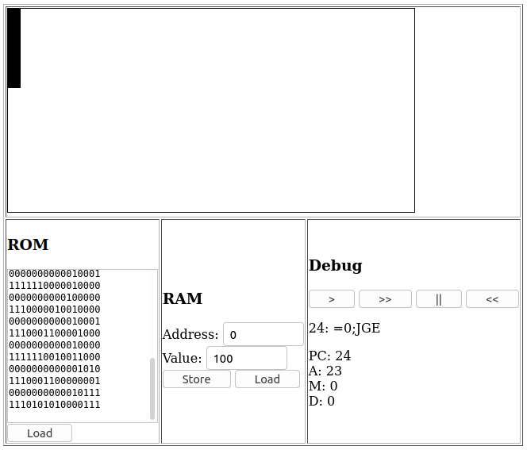

## n2t-wasm

Emulator for the [nand2tetris](https://www.nand2tetris.org/) computer (built
using Rust and WebAssembly).

### Demo

https://abhaynayar.com/n2t-wasm/

- The `Rect.hack` ROM is preloaded into the webpage.
- First click on `Load` to load the **ROM** into the emulator.
- Then **Store** the height of the rectangle at address 0 in the **RAM**.
- Finally hit the `>>` button.
- You'll see a rectangle get drawn on the screen!



_The render loop bottlenecks on `requestAnimationFrame` so larger programs like Pong don't run at the moment. However when the loop is implemented in wasm, it runs very fast and crashes the browser. Trying to find out a better way to implement the render loop._

### Environment

We will follow the official rustwasm
[book](https://rustwasm.github.io/docs/book)
to set up the required tools.

Installing **Rust** (using _rustup_):

```
curl --proto '=https' --tlsv1.2 -sSf https://sh.rustup.rs | sh
```

Installing **wasm-pack**:

```
curl https://rustwasm.github.io/wasm-pack/installer/init.sh -sSf | sh
```

Installing **npm** (using _nvm_):

```
curl -o- https://raw.githubusercontent.com/nvm-sh/nvm/v0.37.2/install.sh | bash
nvm install node
```

### Build

Clone the repository `git clone https://github.com/abhaynayar/n2t-wasm`

Run `wasm-pack build` in the root directory to build the wasm modules.

Run `npm run start` in the `www` directory to start a local testing instance.

Run `npm run build` in the `www` directory to publish the results to `dist`.

### Backlog

- [ ] _Important:_ Fix the render loop so that it's fast enough and doesn't crash.
- [ ] _Bug:_ Index of instruction to be executed should be within ROM size.
- [ ] _Bug:_ Crash when `Rect.hack` is running with RAM[0] > 513.
- [ ] _Bug:_ Sanitize "Insert RAM" inputs.
- [ ] _Feature:_ Transfer words instead of pixels from wasm to js.
- [ ] _Feature:_ Show sample ROMs and a file picker on the web page.
- [ ] _Feature:_ Add keyboard support.
